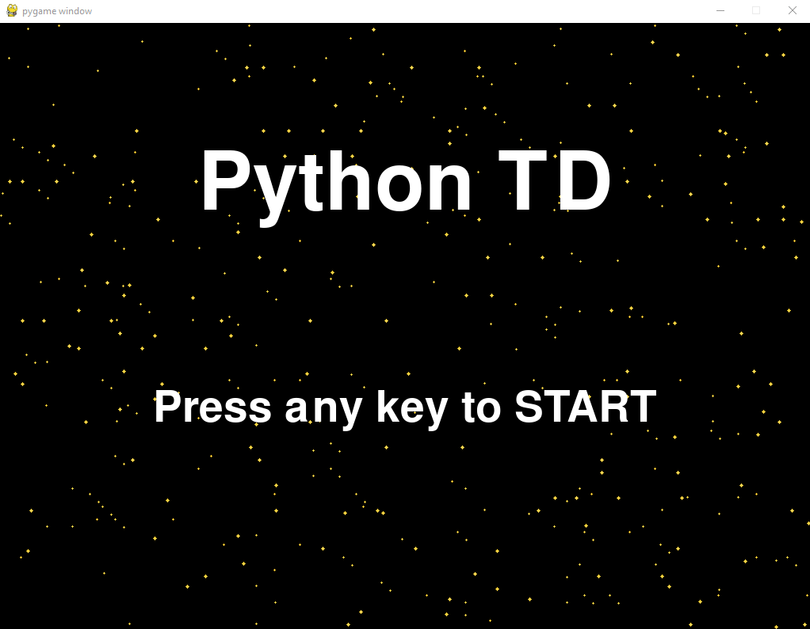
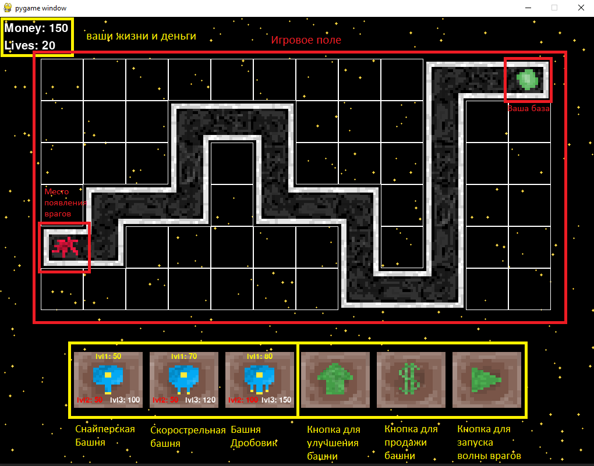
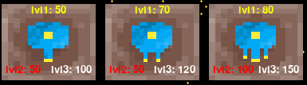
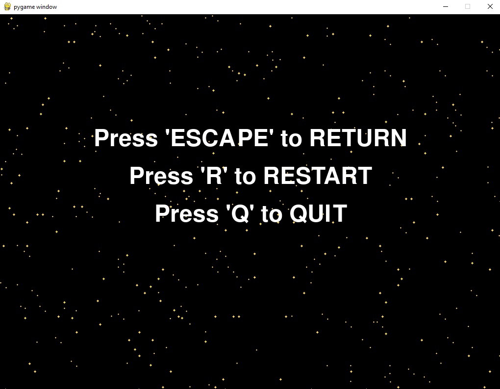
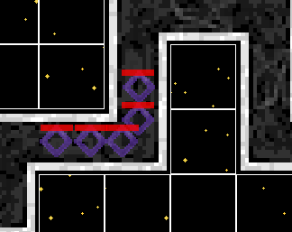
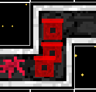
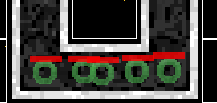
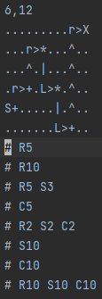

<h1 align="center">PythonTD</h1>

## Описание
PythonTD это игра в жанре Tower Defense разработанная на **python** при помощи модуля **pygame**.
В этой игре вам нужно защищаться от волн врагов расставляя башни для защиты.
Если враги добираются до вашей базы, то вы теряете жизни. 
Если у вас заканчиваются жизни, то вы проигрываете.

## Реализация

### Главное меню
Как только вы запустите игру, вы увидите главное меню 
 
Для того чтобы начать игру вам надо нажать на любую кнопку клавиатуры 

### Интерфейс
 
На кнопке башен указана цена покупки желтым цветом 
Цена улучшения на второй уровень красным цветом 
И цена улучшения на третий уровень белым цветом 
 

### Меню
Если нажать на кнопку ESC, то вы окажетесь в меню где у вас есть выбор выйти из игры
или начать сначала 
 

### Враги
В игре есть три вида врагов 
####Ромбовидные
Это стандартные враги 
 
####Квадратные
Квадратные враги имеют больше здоровья чем ромбовидные, но они очень медленные 
 
####Круглые
Круглые враги очень шустрые, но у них не много здоровья 
 

### Уровни
Если вы пройдете все волны на одном уровне игра сразу
перекинет вас на следующий уровень. 

У вас также есть возможность создавать свои собственные уровни с волнами 
Если в папке **data/maps** создать текстовый документ можно начать создания своего уровня 

На первой строке указывается размер карты (int:высота,int:ширина) 
после чего идет сама карта 
Символы для генерации карты: 
**.** - Пустая клетка куда можно ставить башни 
**S** - Точка появления врагов (Нужно ставить ровно одну) 
**X** - Ваша база (Нужно ставить ровно одну) 
Дороги: 
**|**, **^** - Вверх и вниз 
**>**, **<** - Вправо и влево 
**r**, **R** - Вверх вправо и вниз влево 
**\\**, * - Вверх влево и вправо вниз 
**L**, **l** - Вниз вправо и влево вверх 
**/**, **+** - Вниз влево и вправо вверх 

Далее идет генерация волн. Каждая волна начинается с **#** 
после чего через пробел указываются типы врагов и их количество 
**R** - ромбовидные враги (стандартные) 
**S** - квадратные враги (медленные, но живучие) 
**C** - круглые враги (быстры, но с малым количеством жизней) 

Это текст первого уровня 
 

## Запуск проекта
Чтобы запустить проект, нужно установить все модули из requirements.txt
и запустить файл **main.py** который находится в корневой папке
